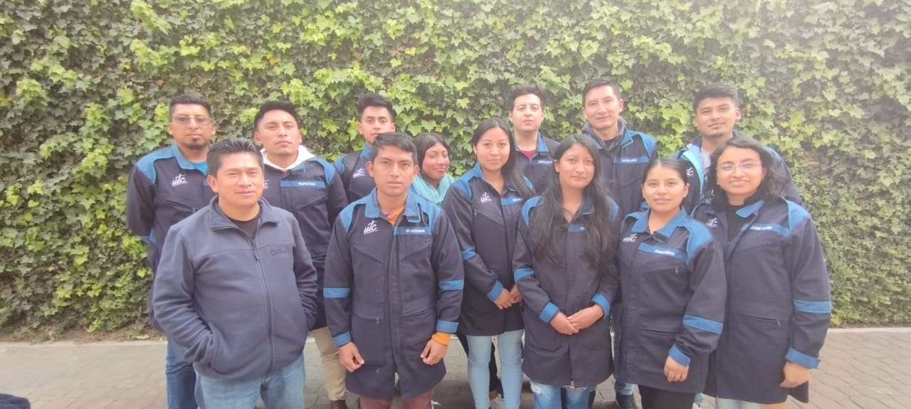

<h2 align="center">Hola  , Yo Soy Pablo Pullopaxi</h2>

   
   
  

  

**Hablando de cosas personales:**

- 👨🏽‍💻 Actualmente estoy estudiando algo genial :wink:.
- 🌱 Actualmente estoy aprendiendo Aplicaciones Moviles.
- 💬 Pregúntame sobre cualquier cosa, estoy feliz de ayudar.
- :muscle: Me Gusta Esforzarme
- 📫 Cómo contactarme: [pablo.pullopaxi1155@utc.edu.ec](https://mail.google.com/mail/u/0/#inbox)
- WhatsAPP:[0998638968](https://wa.me/qr/32ZBIFPO4BWTF1)

***

  

📈 Mis estadísticas de GitHub  

    
   
   
  

*NOTA: 'Lenguajes más usados' no indica mi nivel de habilidad ni nada por el estilo, es una métrica de GitHub sobre los lenguajes en los que tengo más código en GitHub, es una nueva función de [github-readme-stats](https://github.com/anuraghazra/github-readme-stats)*

 

**Lenguajes y herramientas**

<code></code>
<code></code>
<code></code>
<code></code>
<code></code>
<code></code>
<code></code>
<code></code>

***

 

 
  Contador de visitas 
  

-----
Créditos: [Pabloutc](https://github.com/Pabloutc)

Última edición: 12/07/2024
